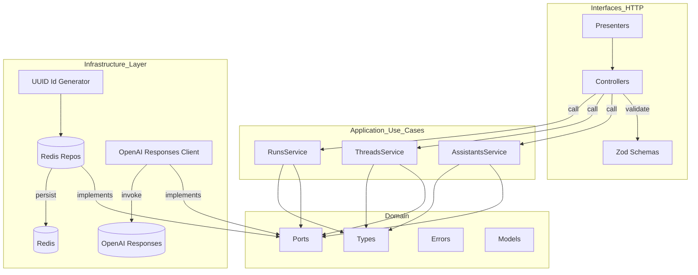
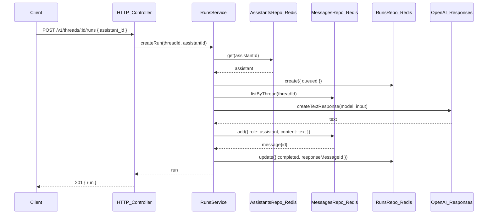

## Assistants API Middleware (Responses-backed)

Fastify + TypeScript server that exposes a minimal Assistants API facade while invoking the newer Responses API. Designed to ease migration: keep your Assistants-shaped client calls, switch the backend to Responses.

This project follows Clean Architecture with an MVC-style HTTP interface, Redis-backed persistence, and structured logging.

### Highlights
- Assistants: create/list/get/update
- Threads: create; Messages: list/add
- Runs: create/get/list — translates thread context to a single Responses call
- Clean architecture: domain, application (services), infrastructure (repos/clients), interfaces (HTTP controllers)
- MVC-ish controllers with Zod validation and presenters that shape responses like Assistants
- Structured logs (ISO ts, level, component, version)

### Requirements
- Node 18+
- `OPENAI_API_KEY` in environment or `.env`
- `REDIS_URL` (Redis 7+) — required for persistence

### Quick start
```bash
npm install
echo "OPENAI_API_KEY=sk-..." > .env
echo "REDIS_URL=redis://localhost:6379" >> .env
npm run dev  # http://localhost:3000
```
### Docker
Build locally:
```bash
docker build -t assistants-api-middleware:local .
docker run --rm -p 3000:3000 \
  -e OPENAI_API_KEY=sk-... \
  -e REDIS_URL=redis://host.docker.internal:6379 \
  assistants-api-middleware:local
```

Images are published to GHCR on release:
- `ghcr.io/<org-or-user>/assistants-api-middleware:latest`
- `ghcr.io/<org-or-user>/assistants-api-middleware:<version>`

GitHub Releases also attach an `linux-amd64` image tar for offline use.


`.env`:
```bash
OPENAI_API_KEY=sk-...
PORT=3000
# Redis is required
REDIS_URL=redis://localhost:6379
```

### Health check
```bash
curl -s http://localhost:3000/health
# {"status":"ok"}
```

### API shape (Assistants-like)
- Assistants resources include `object: "assistant"`, `created_at`.
- Threads: `object: "thread"` with `created_at`.
- Messages returned as `object: "list"` of items shaped like Assistants messages (text content parts).
- Runs returned as `object: "thread.run"`.

### Example flow
1) Create assistant
```bash
curl -s -X POST http://localhost:3000/v1/assistants -H 'content-type: application/json' \
  -d '{"name":"Helper","instructions":"Answer briefly.","model":"gpt-4o-mini"}'
```

2) Create thread
```bash
curl -s -X POST http://localhost:3000/v1/threads
```

3) Add message
```bash
curl -s -X POST http://localhost:3000/v1/threads/<thread_id>/messages -H 'content-type: application/json' \
  -d '{"role":"user","content":"Hello!"}'
```

4) Run
```bash
curl -s -X POST http://localhost:3000/v1/threads/<thread_id>/runs -H 'content-type: application/json' \
  -d '{"assistant_id":"<assistant_id>"}'
```

5) List messages
```bash
curl -s http://localhost:3000/v1/threads/<thread_id>/messages
```

### Quick reference (HTTP)
- POST `/v1/assistants` — create assistant `{ name?, model?, instructions? }`
- GET `/v1/assistants` — list assistants
- GET `/v1/assistants/:assistant_id` — get assistant
- POST `/v1/assistants/:assistant_id` — update assistant
- POST `/v1/threads` — create thread
- GET `/v1/threads/:thread_id/messages` — list messages (list wrapper)
- POST `/v1/threads/:thread_id/messages` — add message `{ role, content }` (`role` in `user|assistant|system`)
- POST `/v1/threads/:thread_id/runs` — create run `{ assistant_id, temperature? }`
- GET `/v1/threads/:thread_id/runs` — list runs (list wrapper)
- GET `/v1/threads/:thread_id/runs/:run_id` — get run

### Project layout
```
src/
  domain/            # Entities and interfaces (ports)
  application/       # Use cases (services)
  infra/             # Redis repositories, OpenAI Responses client, ID generator
  interfaces/http/   # Controllers, presenters, DTOs, validation, error handling
  container.ts       # Simple DI wiring (switches infra via env)
  server.ts          # Fastify bootstrap
```

### Notes & next steps
- Persistence requires Redis (set `REDIS_URL`).
- Add streaming endpoints and tool-calls if needed.
- The included OpenAPI YAMLs serve as references; not used for runtime validation.

### Architecture

Component layering (Clean Architecture-inspired):



Run flow (create run over a thread):



### Architecture
- Clean Architecture layering:
  - Domain: core types, errors, ports (`src/domain`)
  - Application: use cases (`src/application`)
  - Interfaces: HTTP controllers/validation/presenters (`src/interfaces/http`)
  - Infrastructure: repos and external clients (`src/infra`)
- Dependency flow: outer layers depend inward; infra implements domain ports.

### CI/CD
- CI: `.github/workflows/ci.yml` — build and test on Node 18/20/22; matrix includes runs with and without Redis service. Tests that require Redis are skipped when `REDIS_URL` is not set.
- Release: `.github/workflows/release.yml` — on release from `main`, pushes multi-arch Docker images to GHCR and uploads an amd64 image tar to the release.

### Testing
```bash
npm test        # run once
npm run test:watch
```
Tests include:
- Services tests using Redis repos (set `REDIS_URL`) and a fake Responses client
- HTTP integration test booting Fastify via `buildApp()`

### License
MIT (add a `LICENSE` file if publishing publicly)
